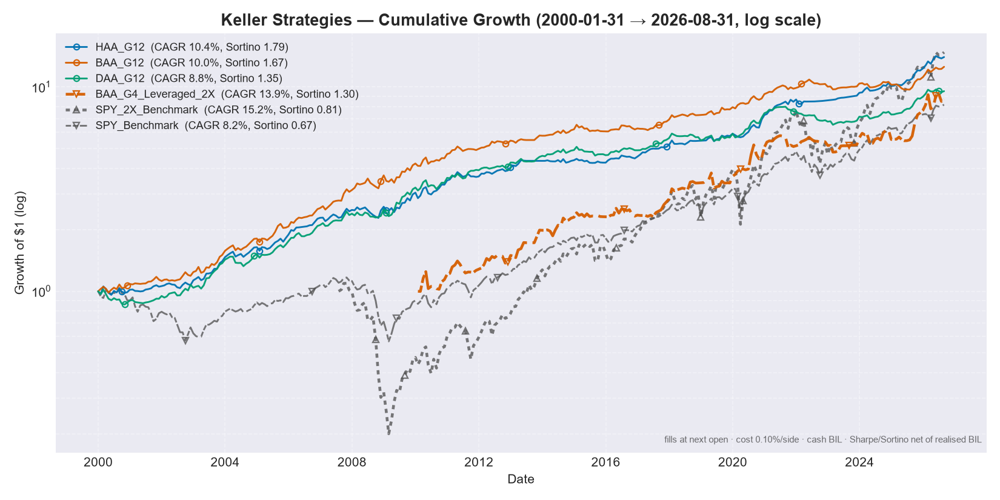
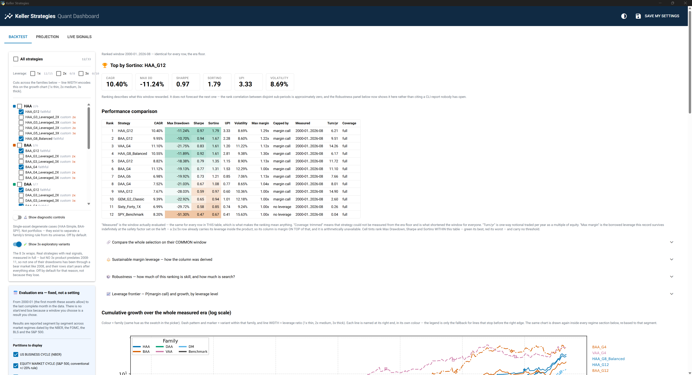

# Keller Strategies 📈


An open-source Python engine for backtesting and live-execution of state-of-the-art
**Tactical Asset Allocation (TAA)** strategies, based on the peer-reviewed research of
Dr. Wouter Keller, Meb Faber, Gary Antonacci, and others.

The suite implements the Keller canon — HAA, DAA, VAA, BAA, PAA — verified line-by-line against
the source papers, plus a four-module dual-momentum sleeve and Faber's trend-following GTAA. It
compares their performance interactively and generates exact monthly rebalancing signals,
including leveraged-ETF variants and configurable margin.

> **Rebuilt 2026-07-28 after an adversarial audit**, which found that execution price,
> rebalance date, transaction cost, the meaning of a missing price and the meaning of cash
> were all *implied* by a single vectorised expression rather than modelled. It now has an
> explicit execution ledger, coverage guards, honest metrics and run manifests.
>
> **Two further audits followed on 2026-07-29** and found what the first had checked around:
> DAA applied an absolute-momentum filter its paper disclaims three times, and `SMA12`
> averaged twelve prices where Keller defines thirteen. Both moved every published DAA, BAA
> and PAA number.
>
> **Every number in this repository is lower than it was, and that is the point.**
> [`KNOWN_GAPS.md`](KNOWN_GAPS.md) is the standing list of what this engine still cannot
> establish — read it before quoting any figure.



> *Regenerated 2026-07-29, after the DAA and SMA12 corrections.* Fills at the next session's open, 0.10%
> one-way cost per leg, uninvested weight in BIL, Sharpe and Sortino net of the realised BIL
> return, wealth curve starting at 1.0. The title states the window that was **measured**, not
> the one requested.
>
> Read the leveraged line with the coverage caveat in mind — its products have no bear-market
> history before 2008. See [`KNOWN_GAPS.md`](KNOWN_GAPS.md).

## ✨ Highlights

- **7 strategy families, 36 registered variants.** An entry is admitted only if it is a universe its author published, the same on substitute funds, a universe this repo was *forced* to invent so a leveraged sleeve executes at one uniform multiple, a single-asset control, or a passive benchmark. Sixteen entries went on 2026-07-28 and five more on 2026-07-29 — one of which, `DAA_G3_Leveraged_2X`, was restored the same day once the rule that deleted it was restated in the form that chooses a parameter rather than discards a variant. Every row of the report carries its own label: `faithful` / `proxy` / `custom` / `control` / `benchmark`.
- **The leveraged variants have their own admission rules, written before the backtest** — because they are the one part of this repo with no author to defer to. The decisive one: *a wrap may change what is HELD, never what decides to DE-RISK.* VAA and PAA protect by counting breadth over their own offensive universe, so restricting that universe for LETF execution rewrites the protection rule instead of just narrowing the portfolio; **their leveraged variants were deleted, and not because they performed badly.** HAA gained one the same day, on the same rule. See [`LEVERAGE.md`](LEVERAGE.md) §8.
- **Desktop dashboard (NiceGUI)** — backtests *and* live whole-share order sizing across multiple broker accounts, in a native window. Double-click `run_dashboard.bat` on Windows, no code required.
- **Personal settings stay private** — account balances, strategy picks and every user knob live in a gitignored `user_config.json`, never in the code.
- **Leveraged-ETF execution** — a faithful "wrap pattern" runs the canonical signal on 1x assets and maps the offensive sleeve to real leveraged ETFs (e.g. `SPY → UPRO`), holding the defensive sleeve at 1x. Only universes that execute at a *uniform* multiple are admissible, and the mapper enforces it at construction.
- **Single external data source** — Yahoo Finance only. No FRED, no macro series, no second provider to keep in sync.
- **An explicit execution model** — fills at the session *after* the signal, one-way cost charged per leg on the notional actually traded, positions that drift between rebalances, uninvested weight in a real cash asset, and margin interest day-counted on the balance actually drawn. None of it implied; all of it configurable.
- **The engine refuses rather than approximates** — a month whose weights do not sum to 1, or that holds a ticker with no price, raises instead of being recorded as a 0% return. A strategy is never measured over years its own products did not exist: the window is trimmed and the binding ticker is named.
- **Reports that argue against themselves** — a regime panel showing behaviour in eight named drawdowns (`n/a` where coverage is missing, never a number), the expected best-of-N under the null next to the observed best, and the rank correlation of the leaderboard between disjoint sub-periods. It comes out near zero, and the report says so.
- **There is no date picker, and that is the feature** — a window you choose is a result you chose. The engine runs a fixed era (2004-11 → the last *complete* month — the floor is the first month a *strategy* rather than a passive benchmark can be measured, and it may never rise above 2007-11 because the GFC segments open there) and reports every strategy across four pre-registered partitions of it: the **NBER** business cycle, the **S&P 500** bull/bear cycle, the **FOMC** rate cycle, and **BLS CPI** inflation regimes. The segments tile the era with no gap and no overlap — a test compounds them back to the era's own return — and every panel is measured over each strategy's *full* history, so no run can shorten a regime. An `n/a` means the assets did not exist, never "you asked for a shorter window". The ranked table uses one window shared by every row, derived from the data as the latest inception among the strategies compared, with **every** binding one named — ties are the normal case, so naming just one made the report's own "drop it to lengthen the window" advice false. Since 2026-07-29 entries nobody published (`custom`) are not allowed to set that window at all: four leveraged G4 wraps were costing all 25 then-registered rows nineteen months and hiding 2008 from the headline drawdown column. **Nor is anything holding a leveraged product, whatever its fidelity label** — every LETF launched 2006 or later, so a levered *benchmark* labelled `faithful` (100% UPRO has no rule to be unfaithful to) would have re-introduced the same defect through the label rather than the role. Both exclusions are in `main.may_set_ranked_window`. Excluded entries are still measured, in a separate block, over their own window.
- **Three answers to "which window?", because there is no free one** — the ranked table gives ONE window to the entries that reach it and measures late arrivals in a clearly separated block; `RANKED_WINDOW_POLICY='all'` forces one window over everything at the cost of the 2007-2009 bear, the most discriminating stretch in the record; and the dashboard's **common-window comparison** intersects the months of whatever you have ticked and re-measures every entry on them, naming the entry that binds so you can untick it. Best for a two- or three-way question, worst for a large selection.
- **A leaderboard per regime, not just a matrix** — under the four partition tables, each segment gets its own small ranked table: who actually led the GFC, the COVID crash, the 2022 bear. It inherits the ranked table's one rule — every row spans the same months — so a strategy that entered a segment late is listed with what it covered and is **not** ranked. Arriving after the crash shows the recovery without the fall, and ranking that would rebuild date-selection bias inside the very panel built to remove it. The dashboard renders the same thing as nested expansion panels.
- **UPI (Ulcer Performance Index)** — Keller's own primary ranking metric, `(CAGR − rf) / Ulcer Index`, alongside CAGR / MaxDD / Sharpe / Sortino / Volatility.
- **Provenance on every artefact** — each saved report carries a `*.manifest.json` with the commit, the data hash, the resolved config, and the window actually measured.
- **Deterministic test suite with EXTERNAL anchors** — momentum checked against a closed form derived in the test file, strategy baskets against arithmetic done by hand, cost against the paper's stated one-way rate, and a golden master that fails on purpose whenever a fix moves a number.
- **Every strategy checked against its own paper's rule** — `tests/test_paper_rules.py` re-derives each family's selection rule from hand-built panels, independently of the code. It exists because two Keller-compliance defects survived two audits and 131 self-consistency tests: DAA applied an absolute-momentum filter its paper disclaims three times, and `SMA12` averaged twelve prices where Keller defines thirteen. Both moved every published DAA, BAA and PAA number. See [`KNOWN_GAPS.md`](KNOWN_GAPS.md) §7.
- **Every fidelity claim carries a citation** — `faithful` / `proxy` / `custom` is no longer a bare string: each entry names the paper, section or figure behind it, and a test asserts all 36 have one. Four labels have been found wrong so far, all four in the under-claiming direction — so since 2026-07-30 every key's `(fidelity, paper, section)` is also pinned in `tests/test_paper_rules.py::TestFidelityAgainstSource`, where a wrong label fails CI instead of waiting for someone to re-read a PDF.

## 🖥️ Desktop Dashboard

```bash
python app.py        # native desktop window (or your browser as fallback)
```

On Windows you can simply **double-click `run_dashboard.bat`** — the first run sets up the
environment automatically, later runs start instantly.



- **Backtest tab** — set margin leverage, borrowing cost and transaction cost, and get a
  ranked metrics table (CAGR, Max Drawdown, Sharpe, Sortino, **UPI**, Volatility) that also
  shows the window actually **measured**, realised turnover, and any coverage trim — plus one
  expandable table per market regime (NBER / S&P 500 / FOMC / CPI), a log-scale growth chart
  and each strategy's latest target allocation. **There are no start and end date boxes**:
  the era is fixed. The selection statistics and rank stability are in the CLI report.
- **The strategy picker is a checklist, ticked by default** — every strategy runs unless you
  untick it, with a master switch and one box per family. It saves what you turned *off*
  (`EXCLUDED_STRATEGIES`), so a variant added to the registry later appears on its own
  instead of being frozen out by a list written months ago. The two single-asset **controls**
  are hidden behind a switch: they are diagnostics for splitting a family's record into its
  timing rule and its universe, not portfolios to hold.
- **The growth chart encodes three ways at once** — colour by family, dash pattern and
  marker by variant within it, and every line named at its own right-hand end in its own
  colour. Twenty-odd lines drawn from one continuous colormap were not distinguishable; the
  legend is now reduced to what the labels cannot say, which is what the hues mean.
- **The chart is drawn once per period section, not once per run** — the whole era at the
  top, and again inside *every* regime segment, re-based to 1.0 at that segment's start and
  rendered the first time you open it. "What did this return in the GFC" was already a
  number; now the path is there too, at a scale where the GFC is not four inches wide. The
  ADVERSE bucket gets one as well, on an ordinal axis, because those months are not
  contiguous and a date axis would draw straight lines across the good years between them.
- **A `Max margin` column, and the cap that produced it** — how much *borrowed* leverage
  each record survives indefinitely, from `common/margin_sizing.py`. It needs no data from
  your broker: the credit-line cap reports itself unbounded rather than guessing, the borrow
  rate was already a knob, and the maintenance requirement comes from a stated convention
  (30% base, times the fund's own multiple for a leveraged product). Two columns rather than
  one, because `1.00x` from the Kelly gate ("borrowed money would have reduced growth") and
  `1.00x` from margin survival ("the broker would have closed you out") are opposite findings
  that print the same number.
- **A robustness panel that argues against the table above it** — three measurements, folded
  away and computed only when opened. The **selection context** and **rank stability** figures
  the CLI has printed for months and the dashboard merely *cited* ("the rank correlation
  between disjoint sub-periods is approximately zero" — pointing at a report nobody had open).
  **PBO**, the probability of backtest overfitting, by combinatorially symmetric
  cross-validation over all 12 870 equal splits of the shared window: **42.2%**, with the
  in-sample crown going to `HAA_G12` in only 57% of them. And the leaderboard **rebuilt on
  2 000 resampled histories**, so "rank 1" can be read next to "top three in 87.1% of
  alternative histories" — different claims, now on the same screen. Both measurements also
  run **pooled by family and by de-risking mechanism**, because a family whose every variant
  scores well is harder to explain as luck than one lucky variant: pooling walks the PBO down
  monotonically (42.2% → 37.2% → 30.4%), the HAA family is top-3 in 89.1% of alternative
  histories, and the exogenous-TIP canary wins 71% of in-sample splits at the mechanism
  level. Every figure is net of the run's own realised risk-free rate — the same rate the
  leaderboard nets — and the section prints the rate it used. None of it forecasts: a bootstrap draws from the distribution it is
  given, and if these two decades were generous to US assets then so is every resampled path.
- **A leverage frontier, cross-checking the sizing from an independent direction** — the same
  resampled histories walked month by month at every constant leverage level from 1.0x to
  3.0x, under the ledger's own monthly-reset policy and each entry's own maintenance
  requirement. Three curves per strategy — P(margin call), median CAGR, 5th-percentile CAGR —
  drawn as two stacked panels (never a dual axis), with the `Max margin` advice marked on
  them and its P(call) evaluated on the paths. The closed-form cap and the path walk share
  the maintenance requirement and the borrow rate and *nothing else*; measured, they bracket
  the same band from opposite sides — advice at 1.0–1.3x, month-end calls material only near
  2.0x, the gap being exactly the intraperiod factor monthly paths cannot see. The Kelly
  column is the f that maximises median CAGR across the resampled histories, ruin included.
- **Live signals tab** — enter your broker accounts (filled in priority order) and the
  order-sizing knobs, and get exact whole-share orders per account for the current
  monthly signal, with canary status and remaining cash. The signal is monthly, but
  quantities are sized at the **latest live market quote** (with automatic fallback to
  the month-end close when offline), so orders match what your broker actually charges.
  An optional **price cap** (`PRICE_CAP_MARGIN_PCT`) sizes shares at `quote × (1 + X%)`
  and reports the cap per order — enter it as the limit ceiling on after-hours GTC
  orders (e.g. IBKR Midprice + cap) and they can never be rejected for insufficient funds.
- **💾 Save my settings** persists everything to `user_config.json` (gitignored), which
  the CLI reads too — the GUI and `main.py` always agree.

Data downloads are cached, so re-runs are fast.

## 📚 Strategies & Research

Fidelity is claimed **per strategy, never in blanket form** — see
[`strategy_specs/`](strategy_specs), where each spec cites the paper and page and lists its
deviations, and [`KNOWN_GAPS.md`](KNOWN_GAPS.md) §5 for the summary. The original PDFs are in
[`academic-papers/`](academic-papers).

| Family | Strategy | Source paper (SSRN) |
|--------|----------|---------------------|
| **HAA** | Hybrid Asset Allocation | [Keller, 2023](https://papers.ssrn.com/sol3/papers.cfm?abstract_id=4346906) |
| **BAA** | Bold Asset Allocation | [Keller, 2022](https://papers.ssrn.com/sol3/papers.cfm?abstract_id=4166845) |
| **DAA** | Defensive Asset Allocation | [Keller & Keuning, 2018](https://papers.ssrn.com/sol3/papers.cfm?abstract_id=3212862) |
| **VAA** | Vigilant Asset Allocation | [Keller & Keuning, 2017](https://papers.ssrn.com/sol3/papers.cfm?abstract_id=3002624) |
| **PAA** | Protective Asset Allocation | [Keller & Butler, 2016](https://papers.ssrn.com/sol3/papers.cfm?abstract_id=2759734) |
| **GTAA** | Global Tactical Asset Allocation | [Faber, 2006](https://papers.ssrn.com/sol3/papers.cfm?abstract_id=962461) |
| **DM** | Composite dual momentum (four modules) | [Antonacci, 2012](https://papers.ssrn.com/sol3/papers.cfm?abstract_id=2042750) |

The five Keller strategies above were verified line-by-line against their source PDFs by two
independent audits and match the papers, including the exact cash-fraction formula
`CF = (1/T)·rounddown(bT/B)` and PAA's protection factor `n1 = a·N/4`.

`DM_G8_Composite` is Antonacci's equally-weighted four-module composite — equities, credit,
REITs and a gold/Treasury stress sleeve, each running dual momentum and each defending into
T-bills. It carried a `_Custom` suffix until 2026-07-29 because it had been compared against
**Global Equities Momentum**, a *different* Antonacci strategy (one module, defending into
aggregate bonds). Reading SSRN 2042750 showed the three supposedly invented pairs are his own,
from Table 10. Renamed and relabelled `proxy`; not one line of the allocation logic changed.
It is also the most mechanistically distinct entry in the registry (ρ_max 0.705).

**Removed on 2026-07-28:** FAA, MAA, EAA, LAA, RAA and CAA. Across eight named drawdown episodes
none of them ever outperformed every retained strategy, none implemented its source paper
faithfully, and LAA measured ρ = 0.93 against the retained Golden Butterfly benchmark. Rationale
and evidence: [`KNOWN_GAPS.md`](KNOWN_GAPS.md) §6. Their papers remain in
[`academic-papers/`](academic-papers) for reference.

Detailed per-strategy parameter specs are in [`strategy_specs/`](strategy_specs); the
[TIMELINE.md](TIMELINE.md) traces the evolution of TAA from Faber to Keller, and
[WHY_TAA.md](WHY_TAA.md) covers the rationale for tactical allocation.

> **Our take (a preference, not an impartial ranking).** We lean toward **HAA** for
> *structural* reasons: one external canary (TIP) rather than a breadth count, a defensive
> sleeve that chooses between BIL and IEF instead of defaulting to one, and the most recent of
> Keller's papers. We run **G12** for asset-class breadth — twelve sleeves across US/ex-US
> equity, REITs, commodities, gold and three bond tenors — **not** because it ranks first.
>
> That distinction is deliberate. This README used to claim HAA_G12 had "the family's best
> Sharpe and Sortino", which was wrong twice over: on our own window `HAA_G1_Simple` scored
> higher on both, and in **Keller's own** Dec-1970 → Dec-2022 results HAA-8 beats HAA-12 on
> max drawdown (−9.7% vs −10.7%) *and* Sharpe (1.21 vs 1.19) at an identical 15.9% CAGR.
>
> More generally: **do not pick a variant from the ranked table.** Every backtest report prints
> the rank correlation of that table between disjoint sub-periods, and it comes out at
> approximately zero — the ordering describes what each regime rewarded, it does not forecast
> the next one. That is what the regime panel underneath it is for. This is a personal bias,
> not a scientific or impartial recommendation, and **not financial advice** — 0 liability.

## 🛠 Installation

Requires Python 3.11+.

```bash
git clone https://github.com/yourusername/keller-strategies.git
cd keller-strategies

python -m venv venv
source venv/bin/activate          # On Windows: venv\Scripts\activate
pip install -r requirements.txt
pip install pywebview             # optional — native desktop window for the GUI
```

On Windows, double-clicking `run_dashboard.bat` performs this whole setup on first run.

## 🚀 Usage

### Dashboard (recommended)

```bash
python app.py            # or double-click run_dashboard.bat on Windows
```

### Personal settings — `user_config.json`

All user-specific values (broker account balances, strategy picks, dates, leverage,
sizing knobs...) live in **`user_config.json`** at the project root. The file is
**gitignored**, so your personal data never reaches the repository. Copy
[`user_config.example.json`](user_config.example.json) to get started — every key is
optional and falls back to the documented defaults in `main.py`'s USER DASHBOARD
section. The GUI's *Save my settings* button writes the same file.

### Command line

```bash
python main.py                                           # run with your user_config.json (or the dashboard defaults)
python main.py --list                                    # list every available strategy key
python main.py --strategy HAA_G12 HAA_G4_Leveraged_2X    # run specific strategies
python main.py --live                                    # force live-signal mode
```

Key parameters (defaults in `main.py`, overridable per key in `user_config.json`):

```python
# No START_DATE / END_DATE — the era is frozen in common/eras.py and runs to the last
# COMPLETE month in the data. Putting those keys back in user_config.json prints a warning
# and changes nothing.
DATA_START_DATE    = '2000-01-01'   # How far back to download (for momentum warmup)
LEVERAGE_FACTOR    = 1.0            # Global MARGIN leverage on active strategies (1.0 = none)
MARGIN_BORROW_RATE = 0.06           # Annual interest charged on the borrowed margin portion
EXECUTION_MODE     = False          # False = backtest, True = live target weights
```

- **Backtest mode** computes historical monthly allocations and outputs a performance
  report (CAGR, Max Drawdown, Sharpe, Sortino, Volatility) plus a log-scale growth chart in
  `backtest_results/`.
- **Live mode** outputs the exact target portfolio weights for the configured date, and
  translates them into whole-share orders across multiple broker accounts — in the GUI's
  *Live signals* tab or on the CLI. The order-sizing knobs (safety-margin reserve, minimum
  trade size, and `FLUSH_ROUND_UP_BAND_PCT` — round the last lot up to deploy idle cash in
  accounts without fractional shares) are documented in `main.py`'s USER DASHBOARD and set
  per user in `user_config.json`.

## 🧱 How leverage works

Leverage has two independent, composable sources:

1. **Leveraged ETFs (2x/3x)** — realized through the *real* price history of products like
   UPRO/TQQQ/TMF, so their internal financing cost and volatility decay are already
   reflected. Defensive sleeves are held unleveraged at 1x.
2. **Margin (`LEVERAGE_FACTOR`)** — borrowed-money leverage on active strategies, with
   interest on the borrowed portion charged via `MARGIN_BORROW_RATE`.

A 2x leveraged-ETF strategy run at `LEVERAGE_FACTOR = 1.3` therefore reaches ≈ 2.6x
effective exposure. See [ARCHITECTURE.md](ARCHITECTURE.md) for module details.

### Margin follows the signal

The two mechanisms are not symmetric, and the difference matters. **A leveraged-ETF
portfolio de-levers by itself**: when the canary flips and the strategy rotates from UPRO
into IEF, exposure drops to 1x automatically. **Flat margin does not** — the loan stays
drawn, so the defensive sleeve is bought with borrowed money and the portfolio rides the
drawdown levered. Swapping instruments while keeping the same nominal factor silently
changes the risk profile.

`MARGIN_FOLLOWS_SIGNAL` (default `true`) closes that gap by borrowing only against the
offensive sleeve:

```
effective_leverage = 1 + (LEVERAGE_FACTOR - 1) × offensive_weight
```

Realised average leverage and its range are reported per strategy so the exposure actually
taken is visible rather than assumed. Re-measured 2026-07-29 over
**2008-06 → 2026-06** — the engine's own common window for these three, not a period anyone
chose, and set by HYG's 2007-04 inception — fills at the next open, 0.10%/side, cash in BIL,
Sharpe/Sortino net of realised BIL, 6%/yr borrow:

| Strategy | Mode | CAGR | MaxDD | Sortino | UPI | Avg lev | Turn/yr |
|---|---|---|---|---|---|---|---|
| HAA_G12 | unlevered 1.0x | 9.79% | **−11.19%** | **1.90** | **3.44** | 1.00x | 6.8 |
| HAA_G12 | flat 1.3x | 10.74% | −15.02% | 1.61 | 2.51 | 1.30x | 8.8 |
| HAA_G12 | **signal-following 1.3x** | **10.90%** | **−14.52%** | 1.64 | 2.64 | 1.22x | 8.2 |
| DAA_G12 | unlevered 1.0x | 7.85% | **−18.38%** | **1.39** | **1.10** | 1.00x | 12.2 |
| DAA_G12 | flat 1.3x | 8.21% | −25.36% | 1.13 | 0.75 | 1.30x | 15.8 |
| DAA_G12 | **signal-following 1.3x** | **8.66%** | **−22.02%** | 1.23 | 0.97 | 1.20x | 14.3 |
| BAA_G12 | unlevered 1.0x | 7.34% | **−10.70%** | **1.35** | **1.50** | 1.00x | 10.2 |
| BAA_G12 | flat 1.3x | 7.56% | −18.65% | 1.08 | 0.95 | 1.30x | 13.3 |
| BAA_G12 | **signal-following 1.3x** | **8.05%** | **−14.13%** | 1.28 | 1.37 | 1.14x | 11.5 |

Two separate conclusions, and only the first is about the flag:

1. **Signal-following beats flat margin on every metric while borrowing less.** That is
   not alpha — it is the removal of a cost that was buying no exposure, since flat margin
   pays interest to hold treasuries during exactly the months the signal called for safety.
2. **Margin at 1.3x buys CAGR and sells everything else.** Against the unlevered baseline it
   raises return by +0.22 to +1.11 pp but worsens max drawdown, Sortino *and* UPI in all six
   levered rows, and lifts turnover by ~20%. Whether that trade is worth taking is a decision about risk
   appetite, not a decision the backtest makes for you — and note that a margin account can be
   called intramonth, which this model does not simulate at all
   ([`KNOWN_GAPS.md`](KNOWN_GAPS.md) §3).

Set the flag to `false` to reproduce flat-margin behaviour. Passive benchmarks stay at 1x
either way.

### Admissible leveraged universes

A leveraged strategy is only admissible if its **entire offensive sleeve executes at the
same multiple**. Mixing ratios (or letting an unmapped asset fall through to 1x) makes
effective leverage a function of the monthly signal draw, at which point the backtest no
longer describes the portfolio held. Two rules gate every mapping, documented in
[`common/letf_mapper.py`](common/letf_mapper.py):

- **Leverage homogeneity** — one ratio across the whole offensive sleeve. Canaries and the
  defensive sleeve are exempt: they are signal-only or held at 1x by design.
- **$100M liquidity floor** — the binding risk at retail size is issuer closure, not
  spread. Products below the floor were dropped: `EURL`, `DRN` (3x) and `UBT`, `EET`,
  `EFO`, `URE` (2x). `UCO` was dropped separately for tracking WTI crude rather than a
  broad commodity index.

| Universe | Assets | 2x | 3x |
|---|---|---|---|
| G2 | SPY, QQQ | ✅ | ✅ |
| G3 | SPY, QQQ, IWM | ✅ | ✅ |
| G4 | SPY, QQQ, IWM, GLD | ✅ | ❌ no 3x gold product |
| G12 (Keller's full universes) | + VGK, EWJ, VWO, VNQ, GSG, HYG, LQD | ❌ | ❌ |

**2x wraps are `role='strategy'`; 3x wraps are `role='exploratory'`** — registered, measured
and reported in full, but excluded from every selection statistic and barred from setting the
ranked window. Every 3X twin measured ρ ≈ 0.996-0.999 against its own 2X sibling on shape,
which says nothing about depth: 4 of 4 measured pairs show 3x raising CAGR 2.5-5.1 pp while
worsening Sortino *and* UPI and deepening drawdown 13-22 pp. And no 3x product predates
2008-11, so none has bear-market history. This yields 14 leveraged variants across DAA, BAA,
HAA and DM — VAA and PAA admit no wrap at all (their protection is a breadth count over the
very universe a wrap must restrict; see `strategies/vaa.py` and `strategies/paa.py`).

## 🧪 Testing

```bash
python -m unittest discover -s tests
```

Deterministic and network-free. Three categories, and the third is the one that matters:

1. **Guards** — what the engine must REFUSE: an incomplete month, a window predating a
   strategy's own products, weights that do not sum to 1, a held ticker with no price, a data
   gap longer than five trading days, a canary reading bullish on missing data, a regime
   segmentation that leaves a gap or an overlap in the era.
2. **Golden master** — 8 strategies × 6 metrics pinned over a frozen daily fixture. If a change
   moves a number this fails *on purpose*; regenerate it in the same commit, with the reason.
3. **External anchors** — comparisons against things the code did not produce: 13612U checked
   against a closed form written out in the test, HAA's selection and substitution rules
   against baskets worked out by hand, Keller's stated 0.1% one-way cost as arithmetic, and the
   HAA paper's published result shape as a sanity band.

That third category exists because of what the audit found: before 2026-07-28 all 55 tests
asserted `f(x) == f(x)`, and every one of them passed against an engine with four critical
defects. A test that only compares the code to itself adds coverage but no assurance.

## 🧠 Why momentum?

Momentum is an observation of what markets *actually* do, not a thesis about what they
*should* do. The signal is the price — the compressed sum of all information and
positioning — and a trend-following exit provides built-in protection when leadership
reverses. Applied at the asset-class level through ETFs, it captures the momentum premium
with lower idiosyncratic risk than stock-level approaches, while the canary signals (e.g.
VWO/BND) systematically de-risk the portfolio as conditions deteriorate.

## ⚖️ Disclaimer

**Not financial advice.** This software is for educational, research, and informational
purposes only. Past performance does not guarantee future results. Use at your own risk.

## 🤝 Contributing

Contributions are welcome — see [CONTRIBUTING.md](CONTRIBUTING.md) for guidelines on adding
strategies or improving the engine.

## 📄 License

Released under the [MIT License](LICENSE).
